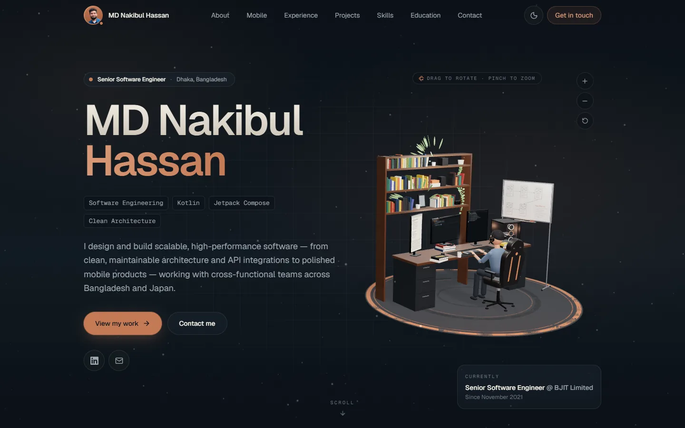
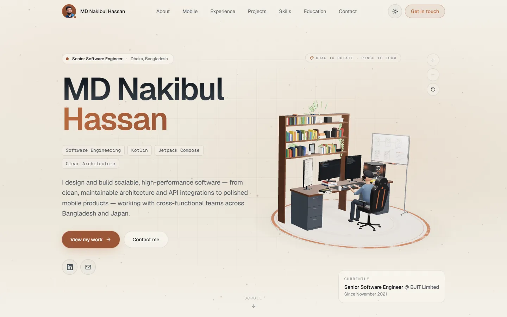
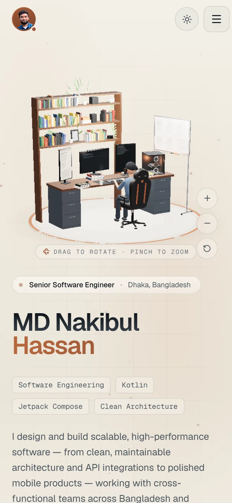
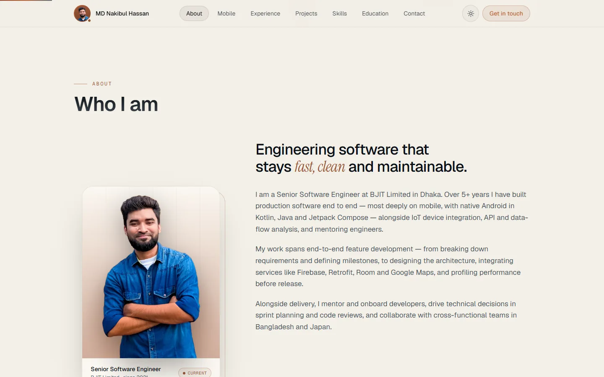
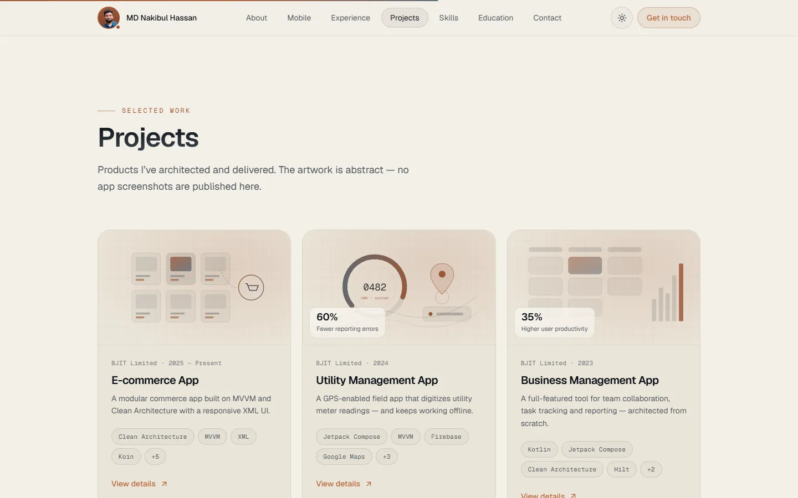

<div align="center">

# MD Nakibul Hassan — Portfolio

**Senior Software Engineer · Android · Kotlin · Jetpack Compose · Clean Architecture**

An interactive, 3D personal portfolio, built with React, TypeScript and Three.js.

[**🔗 Live demo → portfolio-nakibul-dev.vercel.app**](https://portfolio-nakibul-dev.vercel.app/)


</div>



## ✨ Highlights

- **Interactive 3D workstation hero:** a developer at a desk with three monitors, a laptop, a glass-panel PC, a bookcase and a whiteboard. It's built entirely in code, with no 3D model files to download.
  - The centre monitor types Kotlin code live, and the right monitor streams a Gradle build and test run.
  - The developer's hands type with individually moving fingers; the coffee mug steams.
  - **Drag to rotate 360°**, and **pinch or Ctrl + scroll to zoom**. There are also +/−/reset buttons, and ←/→ and +/− keys work too.
- **Dark and light themes** in a copper and charcoal palette. The visitor's choice is remembered, and the page loads without flashing the wrong theme.
- **Sections:** About, mobile specialization (a layered Android stack in a phone mockup), experience timeline, projects with detail dialogs, a skills explorer ("where have I used this?"), mentoring and leadership, education and certifications, and contact.
- **Working contact form** with no backend: it sends through [FormSubmit](https://formsubmit.co), with Web3Forms as an option.
- **Responsive from 320px to 4K.** On phones, the 3D scene appears above the intro.
- **Accessible:** semantic HTML, a skip link, full keyboard navigation, visible focus rings and `prefers-reduced-motion` support.
- **SEO-ready:** meta and Open Graph tags, Twitter cards, JSON-LD `Person` data, a sitemap and `robots.txt`.

## 📸 Screenshots

| Light theme | Mobile |
| --- | --- |
|  |  |

| About | Projects |
| --- | --- |
|  |  |

## 🛠 Tech stack

| Area | Technology |
| --- | --- |
| UI framework | [React 19](https://react.dev) + [TypeScript](https://www.typescriptlang.org) (strict) |
| Build tool | [Vite 8](https://vite.dev) |
| 3D | [Three.js](https://threejs.org) via [React Three Fiber](https://r3f.docs.pmnd.rs) |
| Animation | [Motion](https://motion.dev) (formerly Framer Motion) |
| Styling | [Tailwind CSS 4](https://tailwindcss.com) with CSS custom-property design tokens |
| Icons | [Lucide](https://lucide.dev) |
| Fonts | Geist, Geist Mono and Instrument Serif (Google Fonts) |
| Contact form | [FormSubmit](https://formsubmit.co) (no backend) |
| Hosting | [Vercel](https://vercel.com), with automatic deploys from `main` |

## ⚡ Performance

- The three.js scene is **code-split and lazy-loaded** after the page text renders.
- **Quality depends on the device:** particle count, resolution, antialiasing and real-time shadows are reduced on phones and low-powered devices.
- **Adaptive resolution:** the scene lowers its resolution if frames start dropping.
- Rendering **pauses when the hero is scrolled out of view**.
- **Reduced motion:** visitors with *reduce motion* turned on see a still, finished frame.
- **WebGL fallback:** if WebGL is unavailable, a static SVG illustration is shown instead.
- **Resource cleanup:** every generated geometry, material and texture is released when no longer needed.

## 🚀 Getting started

Requires **Node.js 20+**.

```bash
npm install        # install dependencies (once)
npm run dev        # local dev server → http://localhost:5173
npm run build      # type-check + production build into dist/
npm run preview    # serve the production build → http://localhost:4173
```

## 🗂 Project structure

```
src/
├── data/              ← all portfolio content (edit these)
├── components/
│   ├── hero/          hero layout + WebGL fallback
│   ├── three/         3D scene (workstation, materials, input, palette)
│   ├── about/  experience/  projects/  skills/  android/
│   ├── education/  achievements/  contact/  navigation/
│   └── common/        reusable building blocks (Section, Reveal, TiltCard…)
├── hooks/             media queries, active section, theme
├── utils/             device capability + skill-usage helpers
└── styles/index.css   design tokens + dark / light palettes
public/                images, favicon, OG image, robots.txt, sitemap.xml
docs/screenshots/      README images
```

## ✏️ Updating the content

All text lives in **`src/data/`**, so you rarely need to touch the components.

| What to change | File |
| --- | --- |
| Name, title, intro, email, location, photo, social links, About text, stats | `src/data/profile.ts` |
| Jobs (timeline) | `src/data/experience.ts` |
| Projects | `src/data/projects.ts` |
| Skill groups | `src/data/skills.ts` |
| Mobile/Android stack layers | `src/data/android.ts` |
| Education and certifications | `src/data/education.ts` |
| Mentoring and leadership | `src/data/achievements.ts` |
| Navigation, section headings, site URL, hero 3D object | `src/data/site.ts` |
| Contact form inbox (and optional Web3Forms key) | `src/data/contact.ts` |
| Site colours (dark and light) | top of `src/styles/index.css` |
| 3D scene colours | `src/components/three/palette.ts` |
| SEO tags (title, description, social preview) | `index.html` |

**Tips**
- **Add a project:** copy an entry in `projects.ts` and set `featured: true` for a large card. Add `link: 'https://…'` to show a "Visit project" button. Then add its `id` to the matching job's `projectIds` in `experience.ts`.
- **Add GitHub:** uncomment the GitHub line in `socialLinks` in `profile.ts`.
- **Switch the hero 3D object:** set `heroCenterpiece` in `site.ts` to `'workstation'` (the default), `'workspace'`, `'core'` or `'phone'`.
- **Reorder or remove sections:** edit the list in `src/App.tsx`.

## 🌐 Deployment

The site deploys to **Vercel** automatically on every push to `main`.

- **Contact form:** the first message sent from the live site triggers a one-time **"Activate Form"** email from FormSubmit. Click it once, and later messages arrive in the inbox.
- **Custom domain:** if you add one, update the URL in `index.html`, `public/robots.txt`, `public/sitemap.xml` and `src/data/site.ts`.
- **Other hosts:** any static host works (`npm run build`, then publish `dist/`). For GitHub Pages under `/<repo>/`, set `base: '/<repo>/'` in `vite.config.ts`.

## 📬 Contact

- **Email:** [nakibhasan2711@gmail.com](mailto:nakibhasan2711@gmail.com)
- **LinkedIn:** [linkedin.com/in/nakibulhasan2711](https://www.linkedin.com/in/nakibulhasan2711/)
- **Portfolio:** [portfolio-nakibul-dev.vercel.app](https://portfolio-nakibul-dev.vercel.app/)

---

<sub>© MD Nakibul Hassan. The source code is shared for reference. The personal content (text, photos, logos) belongs to its owner and may not be reused.</sub>
